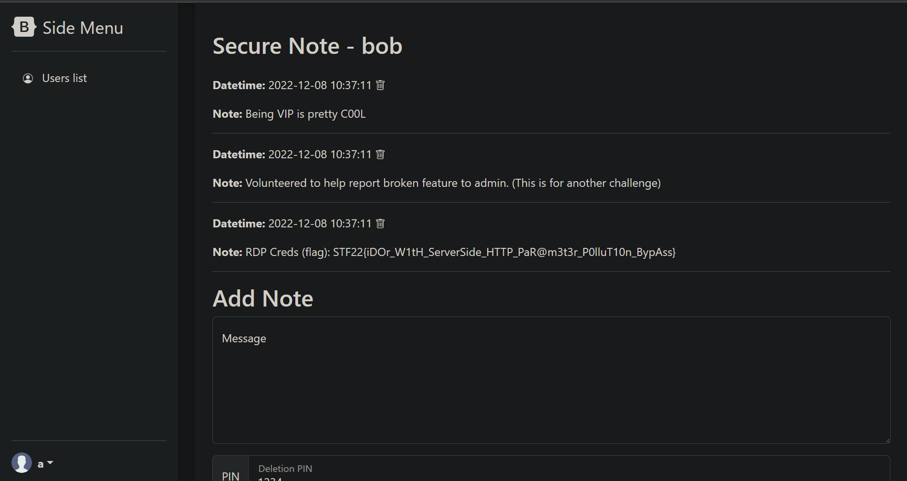

# Hyper Proto Secure Note 1
by [Hal0g3n](https://github.com/Hal0g3n)
> An evil organization has been plotting to pollute the nearby village with its smog engine. Our intelligence team tells us that they have found that the smog engine has an exposed RDP service and they have the username, but not the password. The password is stored in the securenote application that bob uses.
> 
> Find a way to steal the password to turn off the smog machine.
## Solution
When provided with source code, its is the law to read it. Or at least try to understand it. We learnt this the hard way for this problem.
### The False Exploit (Flask Cookie Forgery)
After creating an account and logging in, we find a cookie `session` and we found a decoder for it. It decodes into
```json
{
	"_fresh": true,
    "_id": "9b307e59b8c02a8221fc4ffd810a5ac06fc9cbb3c61c2ac83ad81d6a3d55b2a3956d296527c786574197777d9632e9b494bf70b5b6981546c498d9641924ff24",
    "_user_id": "3"
}
```
We read up online and realised `flask-unsign` exists, allowing us to run through a word-list of possible secret key's but in the end... no flag. After many many attempts of breaking, forging, stealing flask cookies from the cookie jar and spending a day trying to change uid to access **BOB**'s account, we finally tried reading the source code. Here we find the real exploit.
### Insecure Direct Object Reference (IDOR)
Looking through the code we find this very curious snippet in `app.py` in the `/fastapi/<apiname>` function route.
```python
if(uid == str(current_user.user["id"]) or current_user.user["isadmin"]): # Authorisation check to prevent IDOR.
	# pass the url behind to fastapi
	fullurl = request.url
	path = fullurl.replace(request.url_root, "").replace("fastapi", "")
	forwardurl = "http://localhost:8000" + path
```
It seems as though the uid is checked before the filter and our path is directly forwarded to `localhost:8000` (fastapi server). On further inspection, it seems uid is the retrieved using `request.args.get("uid")`. What if we passed another parameter that evaluated to `uid` after the `fullurl.replace`? Well we would have solved the problem, it passes the if statement fine and also allows us to set any uid we want!

By passing in an additional parameter `fastapiuid=2` (`uid=2` after the `.replace`) in our url, we could override the previous uid parameter in the forwarded url and still pass the check, returning us **BOB**'s secure note and the flag.

Payload: `http://server.com/fastapi/retrievekey/?uid=3&fastapiuid=2`

Luckily, they do not check who is accessing these notes, which allows us to steal **BOB**'s notes.

Flag: `STF22{iDOr_W1tH_ServerSide_HTTP_PaR@m3t3r_P0lluT10n_BypAss}`